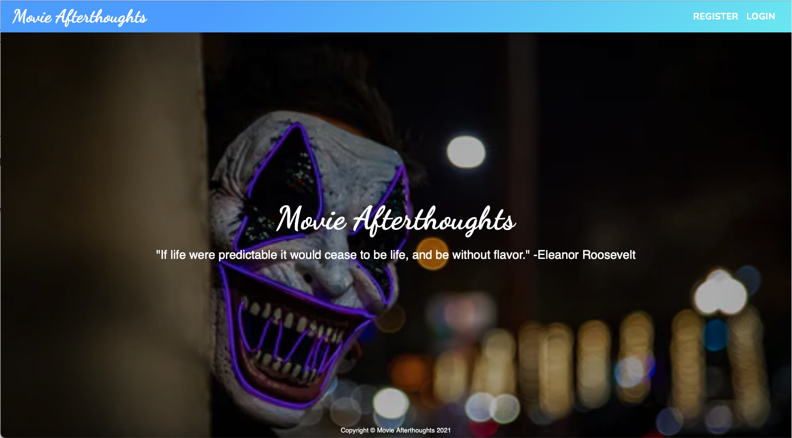
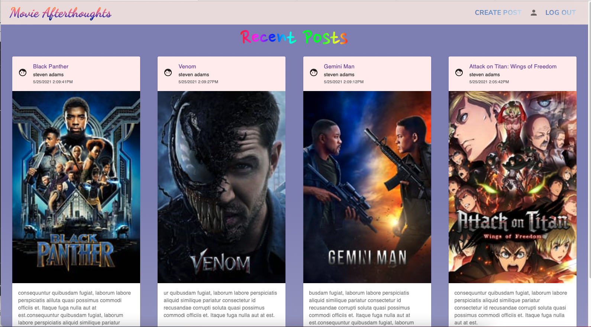

# Movie Afterthoughts

Where movie lovers can post their reviews for movies and interact with other movie fanatics.

[Visit Site](https://movieafterthoughts.me "Movie Afterthoughts")

## Snapshots





## Getting Started

Clone this repository. You will need node and npm installed globally on your machine.

Installation:

```bash
npm install
```

To Start Frontend:

```bash
npm start
```

To View App:

```bash
localhost:3000
```

After completing the steps above, you would have finished setting up the frontend. To set up the backend of the app, please visit [Movie Afterthoughts Backend](https://github.com/danny1233211/moviesAfterthoughtsBackEnd).

## Built With

- [Reactjs](https://reactjs.org/ "Reactjs")

- [Node](https://nodejs.org/ "Node")

- [Express](https://expressjs.com/ "Express")

- [MySQL](https://www.mysql.com/ "MySQL")
- [Material-ui](https://material-ui.com/ "Material-ui")

- [Redux](https://redux.js.org/ "Redux")

## License

Distributed under the MIT License. See [LICENSE](https://github.com/danny1233211/moviesAfterthoughtsFrontEnd/blob/main/LICENSE.md) for more information.

## Acknowledgements

- [formik](https://formik.org/ "formik")

- [yup](https://www.npmjs.com/package/yup "yup")
- [bcryptjs](https://www.npmjs.com/package/bcryptjs "bcryptjs")

- [jsonwebtoken](https://www.npmjs.com/package/jsonwebtoken "jsonwebtoken")
- [date-fns](https://www.npmjs.com/package/date-fns "date-fns")

- [axios](https://www.npmjs.com/package/axios "axios")

- [Netlify](https://www.netlify.com/ "Netlify")

- [Heroku](https://www.heroku.com/ "Heroku")

- [The Movie Database](https://developers.themoviedb.org/3/getting-started/introduction "The Movie Database")
